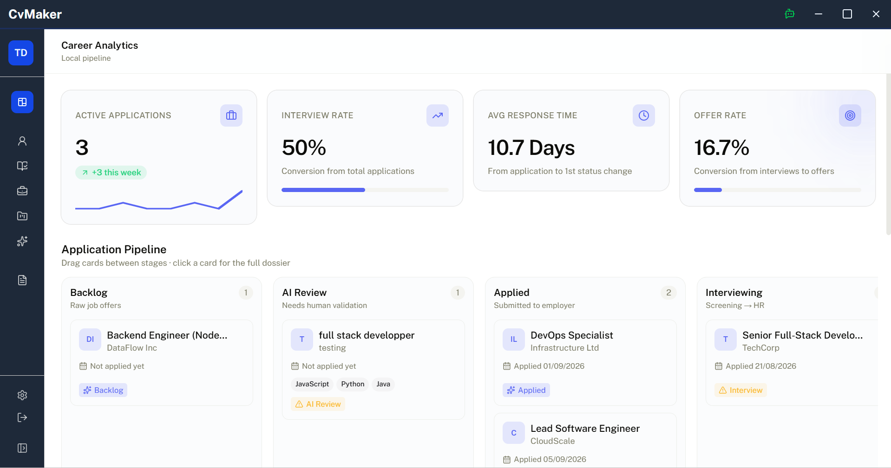

<h1 align="center">CV Maker Engine</h1>

<p align="center">
  
  
  
  
</p>

<p align="center">
  
</p>

<h3 align="center">Built With</h3>

<p align="center">
  
  
  
  
</p>

<p align="center">
  <sub>Fight the ATS and take full control of your job search. Track applications, analyze match rates, and tailor resumes 100% locally.</sub>
</p>

Modern recruitment is broken. Companies use **ATS (Applicant Tracking Systems)** to automatically filter out resumes before a human even looks at them, while online application trackers and resume builders lock essential tools behind expensive subscriptions.

**CV Maker Engine** is a local-first, open-source personal recruitment command center. It bridges application tracking with intelligent resume tailoring—allowing you to track your application pipeline, analyze keyword matching, and build tailored PDF resumes without subscription fees or cloud privacy concerns.

No cloud dependencies, no privacy leaks, zero subscription fees. It's time to build a shield against the corporate bots.

---

## Key Features

* **Application Dashboard & Kanban:** Track your application pipeline stage-by-stage (Wishlist, Applied, Interviewing, Offered, Rejected) with an interactive Kanban board.
* **Analytics & Keyword Insights:** Real-time stats on your job hunt, status breakdowns, and key tech stack/keyword frequency extraction.
* **Hybrid Matching Engine:** 
  * **Lightweight Local NLP/RAKE:** Instant keyword matching and technology extraction against local rule-sets.
  * **Vector & RAG Search:** Local vectorization (`transformers.js` + SQLite) to calculate semantic similarity scores between your profile and job mandates.
  * **Automated Flexible AI Pipeline:** Seamlessly switch between zero-config **Ollama** (autodetected or automatically set up by the app) and cloud-based **Google Gemini API**.
* **Tailored Resume Builder:** Dynamically show/hide sections or sub-blocks, match bullet points to mandates, and export clean PDFs.
* **Local-First Architecture:** Your job search and master profile stay saved locally on your machine.
---

## Technical Stack

The project is built on a modern "Local-First" desktop stack:
* Frontend: React, TypeScript, Tailwind CSS, shadcn/ui.
* State Management: Zustand (Global store).
* Runtime: Electron (Secure IPC communication via contextBridge).
* Database: SQLite (better-sqlite3) for metadata persistence and local vector storage.
* AI & NLP:
    - Embeddings: transformers.js (Model: Xenova/all-MiniLM-L6-v2) for local vectorization.
    - **Local LLM:** Integrated **Ollama** detection and auto-configuration pipeline.
    - **Cloud LLM:** **Google Gemini API** integration for cloud-assisted mandate parsing.

---

## How the Matching Engine Works

The system goes beyond simple keyword searching by using a 3-step processing pipeline:

### 1. Ingestion & Vectorization (Sync)
The application processes structured JSON data for each experience and project. Every "bullet point" is transformed into a mathematical vector (embedding) representing its semantic meaning and stored in **SQLite**.
> **Performance Note:** The "total reconstruction" sync system is optimized for personal use, providing instantaneous responsiveness for individual profiles.

### 2. Mandate Analysis (Input)
When a job description (JD) is submitted, the engine can analyze it in two ways, depending on the user's choice:
- **Hybrid/Local:** Fast keyword and techno extraction based on local whitelists.
- **AI-Powered:** Mistral analyzes the context to extract a structured target profile: { "job_title", "skills", "key_focus" }.

### 3. Scoring & Assembly (Output)
The software calculates the Cosine Similarity between the target mandate vectors and your personal experience database.
- **Suggest**: The engine automatically flags and selects the text blocks with the highest matching scores.
- **Generate**: Instantly exports a tailored, clean PDF resume.

---

## Architecture
The codebase enforces strict boundaries between the desktop environment and the client interface:

```text
📂 Project architecture
├── 📂 electron/          # Desktop & Backend
│   ├── 📂 services/      # Services used on backend
│   └── 📂 functions/     # Functions called by IPC
├── 📂 src/               # UI (React + tailwind + shadcn/ui)
│   ├── 📂 components/    # Graphical components
│   └── 📂 store/         # Global states (Zustand)
└── 📂 shared/            # Shared interfaces between React and Backend (electron)
```

---

## Quick Start
Get your local development environment up and running in less than two minutes:

```bash
# 1. Clone the repository
git clone [https://github.com/Tibab222/cvMaker.git](https://github.com/Tibab222/cvMaker.git)
cd cvMaker

# 2. Install dependencies
npm install

# 4. Run the app in development mode (Electron + React Hot Reload)
npm run dev
```

---

### 📝 Note on LLM
The application manages AI integration out of the box with zero complex manual setup:

1. **Local AI (Ollama):** If you have Ollama installed, the app detects it automatically. If not, the engine assists with the local environment configuration directly from the desktop settings.
2. **Cloud AI (Google Gemini):** Prefer using Gemini? Enter your Gemini API key in the application settings to handle deep mandate parsing and keyword analysis instantly.
3. **Fallback (Offline NLP):** No LLM? No problem. The app falls back to local vector math and keyword rule-sets to keep all scoring features operational offline.

---

## Future Ideas & Contributions (We are hiring ideas!)

We want this application to become the ultimate power-tool for job seekers. We have a massive backlog of features we want to explore, including:
- Custom Template Engine: A system allowing users to import or visually design their own CSS/Tailwind CV templates.
- Smart PDF Onboarding (Resume Importer): Drop your existing PDF resume during profile creation to automatically populate your master JSON database using local text-extraction and NLP parsing.


> **Want to build this with us?** We believe open-source can turn this project into something huge. Check out our CONTRIBUTING.md to join the ride, look at the Issues tab to claim a task, or open a new issue to submit your own crazy ideas!

---

## ⚖️ License

This project is licensed under the MIT License - see the [LICENSE](LICENSE) file for details.